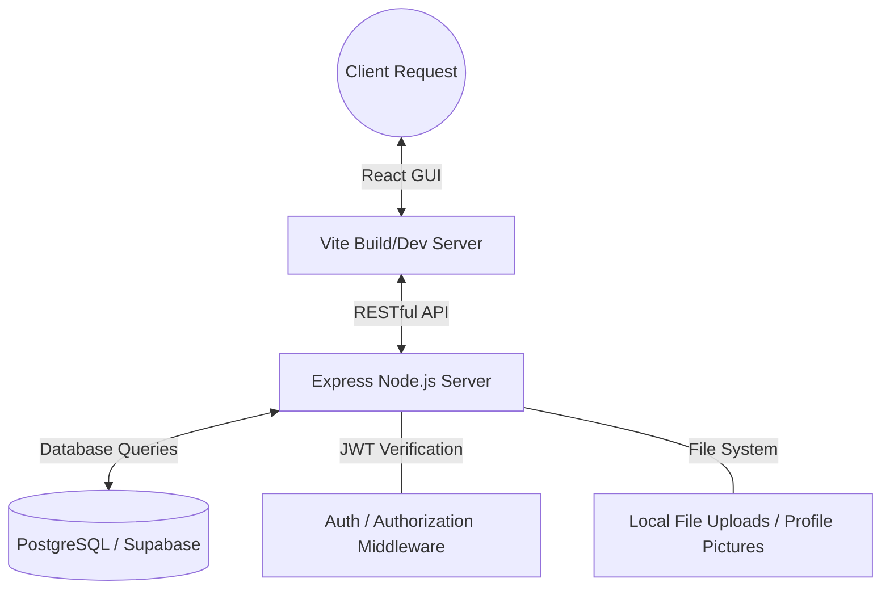

# RegisSPHERE

[](https://reactjs.org/)
[](https://vitejs.dev/)
[](https://nodejs.org/)
[](https://expressjs.com/)
[](https://www.postgresql.org/)
[](https://supabase.com/)

RegisSPHERE is a modern, comprehensive student portal and university management system designed to streamline the academic experience. Built with a focus on usability and clarity, the application offers students a centralized platform to manage their profile, perform course enrollments, track their class schedules, and monitor their academic performance.

## Core Features

- **Dynamic Localization**: Built-in, instant switching between English and Thai languages across the entire application interface.
- **Secure Authentication & RBAC**: Robust user registration and login flows utilizing JWT for session management and Bcrypt for password hashing. Includes specific Student, Professor, and Admin roles.
- **Admin Control Panel**: Comprehensive dashboard for administrators to oversee system operations, manage user accounts, construct the course catalog, and broadcast university-wide news.
- **Enrollment Phase Management**: Admins can transition the system between **Pre-Enrollment** (demand gathering), **Active Enrollment**, and **Closed** phases.
- **Waitlist & Capacity Tracking**: Automatic waitlist promotion when seats become available. Admins can monitor real-time demand for oversubscribed courses.
- **Student Dashboard**: A central hub providing an overview of the student's status with quick navigation to primary academic modules and an aggregated news feed.
- **Professor Portal & Grading**: Dedicated dashboard for professors to view their assigned courses, assign grades to students, download class rosters as CSV files, and post course-specific updates.
- **University News & Announcements**: Global university news board alongside course-specific announcement feeds to keep students and staff informed.
- **Profile Management**: A dedicated settings module allowing users to upload custom profile pictures safely and edit biographical details.
- **Course Enrollment**: An interactive catalog allowing students to search for available courses, view detailed metrics (credits, schedules, capacity, professor), and manage live enrollments or drops.
- **Academic Scheduling**: A detailed "My Courses" interface segmented into logical tabs:
    - **Enrolled Courses**: Overview of current enrollments.
    - **Study Timetable**: An automatically generated, visual grid calendar of the student's week, complete with a functionality to export the timetable as a PNG image.
    - **Exam Schedule**: Clear breakdowns of midterm and final exam dates for enrolled subjects.
- **Study Path Guidance**: A visual curriculum guide helping students track their progress against program requirements and prerequisites.
- **Grades and Progress Tracking**: A dedicated module for students to view academic results, offering sorting by Academic Year, visual grade badges, and automatic calculations for Semester GPA and Cumulative GPAX.
- **Modern Minimalist Interface**: Clean UI built on a unified color system, leveraging Framer Motion for sophisticated animations and glassmorphism principles.

## Technology Stack

The application infrastructure utilizes a modern full-stack web architecture:

| Component | Technologies Utilized |
| :--- | :--- |
| **Frontend Runtime** | React 19, Vite |
| **Frontend Libraries** | React Router DOM for routing, Framer Motion for animation, Lucide React for iconography, html2canvas for image export |
| **Backend Runtime** | Node.js, Express 5 |
| **Backend Modules** | JSON Web Tokens (auth), Bcrypt (encryption), Multer (file uploads), pg (database connectivity) |
| **Database Structure** | PostgreSQL hosted via Supabase |
| **Styling Protocol** | Vanilla CSS using global custom variable properties |

## System Flow Architecture



## Project Structure

The repository is modularly split into the frontend client and the backend server.

```text
COOP/
├── backend/                # Node.js + Express backend server
│   ├── src/
│   │   ├── config/         # Database and connection settings
│   │   ├── controllers/    # API business logic
│   │   ├── middlewares/    # Authentication interceptors
│   │   ├── routes/         # API endpoint definitions
│   │   └── app.js          # Core Express application setup
│   ├── .env                # Local environment variables (ignored in Git)
│   ├── check_schema.js     # Database initialization script
│   ├── migrate_announcements.js # Announcements table migration
│   ├── migrate_grades.js   # Grades migration script
│   ├── migrate_exam.js     # Exam schedule migration
│   ├── migrate_pre_enrollment.js # Phase management settings
│   ├── migrate_student_id.js # Student ID format migration
│   ├── migrate_multiple_professors.js # Multi-professor support
│   ├── seed_admin.js       # Initial administrator account
│   └── seed_courses.js     # Sample data generation script
├── frontend/               # React client application
│   ├── src/
│   │   ├── components/     # Reusable React components (e.g., Form controls)
│   │   ├── context/        # Global React Contexts (e.g., Language translations)
│   │   ├── pages/          # Full-page view components (Dashboard, Grades, etc.)
│   │   ├── translations.js # Centralized EN/TH translation dictionary
│   │   ├── App.jsx         # Primary router and application structure
│   │   └── index.css       # Global stylesheet and CSS variables
│   └── vite.config.js      # Build configurations for Vite
└── README.md               # Primary project documentation
```

## Setup and Installation

### Prerequisites
Ensure your local development environment has the following dependencies:
- Node.js (Version 18.x or higher)
- npm (Node Package Manager)

### 1. Repository Setup
Clone the repository and access the root directory:
```bash
git clone https://github.com/your-username/university-coop.git
cd university-coop
```

### 2. Backend Initialization
Access the backend directory, install packages, and prepare the environment:
```bash
cd backend
npm install
```
Create a `.env` file within the `backend/` directory and apply the following variables:
```env
PORT=5000
DATABASE_URL=your_postgresql_connection_string
JWT_SECRET=your_secure_randomjwt_string
```

Run database migrations to initialize tables and sample data (ensure `DATABASE_URL` is active):
```bash
node check_schema.js
node migrate_multiple_professors.js
node migrate_student_id.js
node migrate_announcements.js
node migrate_exam.js
node migrate_grades.js
node migrate_pre_enrollment.js
node seed_courses.js
node seed_admin.js
```

### 3. Frontend Initialization
Return to the root directory, transition to the frontend directory, and install packages:
```bash
cd ../frontend
npm install
```

### 4. Running the Development Environments
The architecture requires both the server and client running concurrently. Utilize two separate terminal instances.

**Initialize Backend Server:**
```bash
cd backend
npm run dev
```

**Initialize Frontend Client:**
```bash
cd frontend
npm run dev
```

The frontend application will be served at `http://localhost:5173/`, seamlessly proxying backend requests to `http://localhost:5000/`.

## Key REST API Endpoints

The modular backend structure exposes the following capabilities:

| Domain | Method | Endpoint | Description |
| :--- | :--- | :--- | :--- |
| **Authentication** | `POST` | `/api/auth/register` | Account creation |
| **Authentication** | `POST` | `/api/auth/login` | Session initiation |
| **Profile** | `GET` | `/api/profile` | Retrieve user details |
| **Profile** | `PUT` | `/api/profile` | Update user context (Bio) |
| **Profile** | `POST` | `/api/profile/picture` | Handle image buffer uploads via Multer |
| **Courses** | `GET` | `/api/courses` | Retrieve available course catalog |
| **Enrollment** | `POST` | `/api/enrollments` | Process new student enrollment |
| **Enrollment** | `GET` | `/api/enrollments/mine` | Retrieve active student enrollments |
| **Enrollment** | `DELETE` | `/api/enrollments/:id` | Drop specified course |
| **Grades** | `GET` | `/api/grades/mine` | Aggregated GPA and grading data |
| **Admin Controls** | `GET` | `/api/admin/phase` | Get current enrollment phase |
| **Admin Controls** | `POST` | `/api/admin/phase` | Update enrollment phase |
| **Admin Controls** | `GET` | `/api/admin/demand` | Get course demand analytics |
| **Admin Controls** | `GET` | `/api/admin/students` | List all students for management |
| **Announcements** | `GET` | `/api/announcements/university` | Get global university news |
| **Announcements** | `POST` | `/api/announcements/university` | Post global news (Admin) |
| **Announcements** | `POST` | `/api/announcements/course/:id` | Post course announcement (Professor) |

## License
This software project is restricted under the ISC License.
